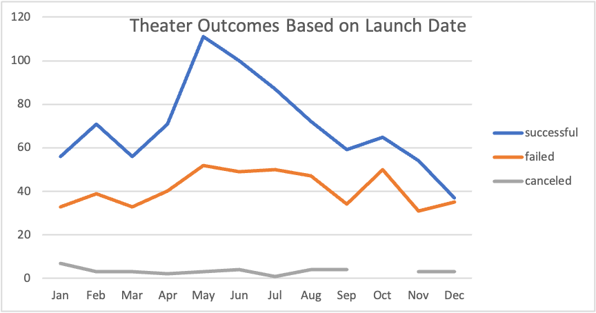
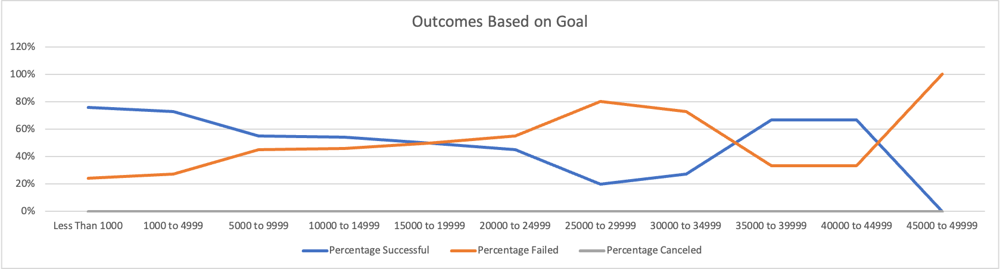

# kickstarter-analysis
Week 1 Course Material 
## Overview of Project
This project looked at a data set that contained several thousand Crowdfunding Projects.  This project used Excel as the analytical tool, using data and visualization.  Specifically, this project looked at how different campaigns fared in relation to their launch dates and their funding goals.  

### Purpose
The purpose of this project was to assist Louise with insight on how different campaigns fared in relation to their launch dates so she could make appropriate decisions moving forward.

## Analysis and Challenges

### Analysis of Outcomes Based on Launch Date

- What are two conclusions you can draw about the Outcomes based on Launch Date?

Two conclusions that can be made about the Outcomes based on Launch Date is 1) Successful Theater outcomes occur in May and June; 2) Failed Theater outcomes appear to be independent of successful outcomes.

### Analysis of Outcomes Based on Goals

- What can you conclude about the Outcomes based on Goals?

Based on the data provided, the conclusion I can make about the outcome based on goals is goal amounts between 1000 to 4999 has the highest amount of successful theater outcomes.

### Challenges and Difficulties Encountered

- What are some limitations of this dataset?

A limitation of the data set is that it doesn’t give much insight into the donors of the campaigns.

- What are some other possible tables and/or graphs that we could create?

Tables and graphs that provide information as to whether a donor is a first-time contributor or a regular campaign donor.  Or a break of the specific demographic to contributors i.e. married/single or a breakout of annual household income.

